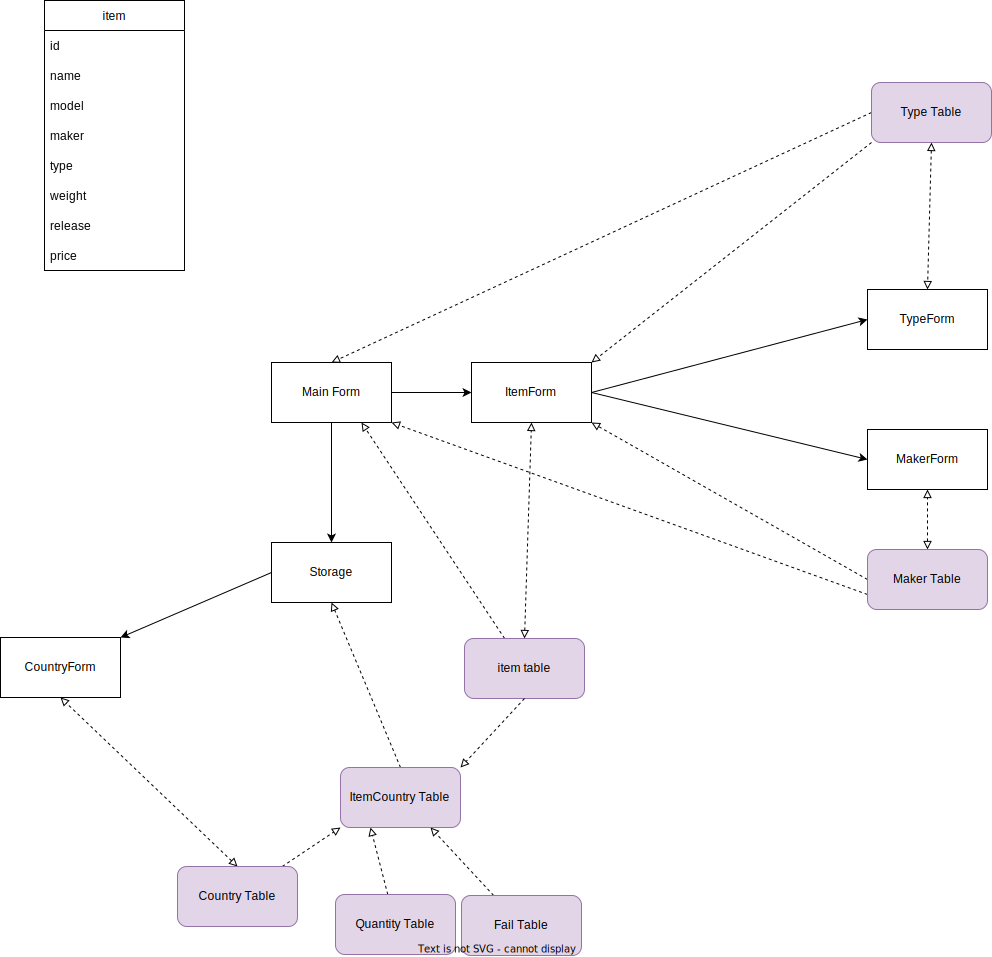
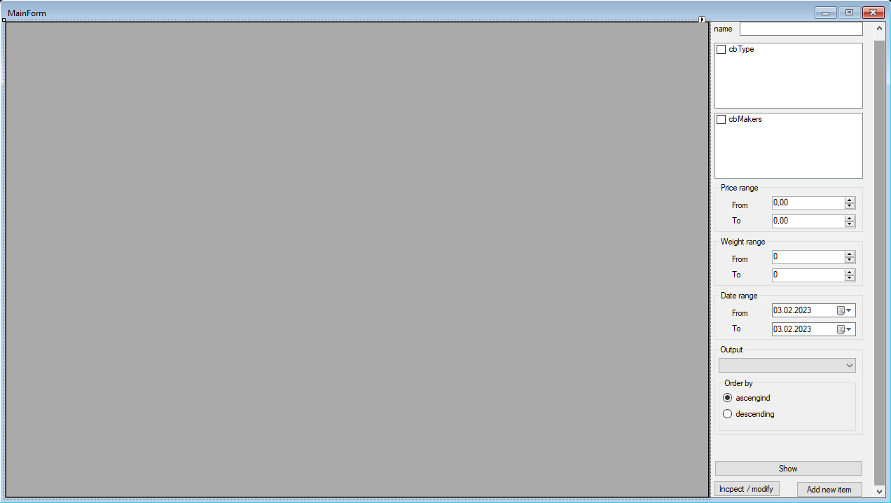
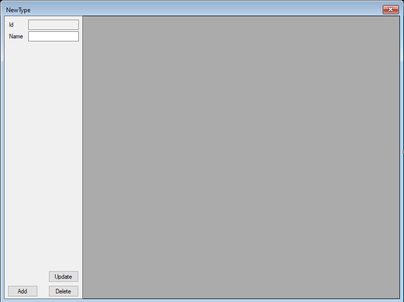

# Курсовой проект

## TOP ACADEMY

Made by Mikhail Mryasov (damaghack@gmail.com)

С использованием:

* C#
* .NET
* ADO .NET
* Microsoft SQL database
* EntityFramework
* WindowsForms

### Платформа

* Windows

## Задание

Задание Основная база данных «Электроприборы».
Предусмотреть:

* [X] ввод данных
* [X] редактирование
* [X] просмотр данных.

Реализовать с использованием нескольких таблиц следующие типы запросов:

* [X] Для каждого вида электроприборов (холодильник, пылесос, стиральная машина, кофеварка, утюги т.д.) указать сведения о нем (наименование, дату выпуска, поставщик, цена, веси т. п.).
  Для каждого типа выдать список отсортированный:

  * [X] по дате выпуска;
  * [X] в алфавитном порядке по поставщику;
  * [X] по весу;
  * [X] по стоимости;
  * [ ] по дате продажи;
* [X] Найти самый дорогой вид электроприборов, самый дешёвый, среднюю стоимость по каждому виду и в целом. ``only query``
* [X] Найти электроприборы с ценой в заданных пределах (предусмотреть ввод цены с клавиатуры).
* [X] Найти все электроприборы заданного производителя (выбор).
* [X] Найти все электроприборы с заданной датой выпуска (ввод даты).
* [X] Найти все электроприборы, чей вес находится в заданных пределах (ввод интервала) для заданного производителя (выбор) и в целом.
* [X] Найти долю электроприборов, проданных за определенный период (ввод периода) от общего времени продаж. ``only query``
* [X] Найти самый популярный вид электроприбора (продано наибольшее количество).``only query``
* [X] Найти долю дешевых электроприборов (чья стоимость меньше заданной, ввод стоимости), поступивших от заданного поставщика и в целом.``only query``
* [X] Найти количество бракованных электроприборов, поступивших из заданной страны (ввод страны, выбор) для заданного поставщика (ввод поставщика, выбор).``only query``
* [ ] Найти среднюю стоимость электроприборов, проданных за определенный промежуток времени (ввод интервала).``only query``
* [ ] Найти все электроприборы, чья стоимость выше, чем средняя стоимость электроприборов заданного производителя.``only query``

---
[Запросы](Queries/README.md)

## Диаграммы

## Визуализация

